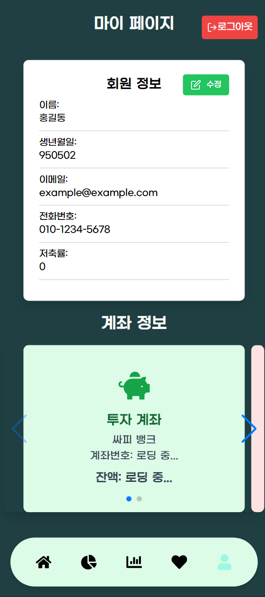

# 목차

1. [**서비스 소개**](#서비스-소개)
2. [**기획 배경**](#기획-배경)
3. [**개발 멤버**](#개발-멤버-및-일정-소개)
4. [**기능 소개**](#기능-소개)
5. [**시연 영상**](#시연-영상)
6. [**기술 스택**](#기술-스택)
7. [**프로젝트 일정 및 산출물**](#프로젝트-산출물)
8. [**회고**](#회고)
    

---

 

# 서비스 소개

## 서비스 설명

### 개요

- 서비스 명 : **`Pig In`**
- 한줄 소개 : **`소액 분산 투자 자동화 서비스`**

### 타겟 🎯

- 가볍게 소액으로 투자하고 싶은 사람
- 자동 투자 관리가 필요한 사람
- 일정 금액을 자동 저축하여 투자하고 싶은 사람

# 기획 배경

## 배경

고물가 고금리 시대에 소액투자에 대한 관심은 나날이 증가하고 있지만 투자할 종목은 많고, 배워야 할 금융 지식 또한 많습니다. 저희 `Pig In`은 좀 더 가볍고 쉽게 투자를 경험해볼 수 있도록 기획된 `소액 분산 투자 자동화 플랫폼`입니다.

## 목적 ☁

**저축 자동화, 투자 자동화를 통한 투자 근육 키우기**

- 저축 자동화 : 소비 금액의 일정 비율을 투자 계좌에 저축합니다.

- 투자 자동화 : 금액과 비율을 설정하면 저축된 금액을 비율에 맞게 투자해드립니다.

- 자동화 투자 관련 포트폴리오를 제공합니다.

# 💌개발 멤버 및 일정 소개

## 📆 프로젝트 기간

### 24.08.26 ~ 24.10.11 (약 7주)

- 기획 및 설계 : 24.08.26 ~ 24.09.06
- 프로젝트 구현 : 24.09.07 ~ 24.10.10
- 버그 수정 및 산출물 정리 : 24.10.11 ~ 24.10.18

 

<table>
    <tr>
        <td height="140px" align="center"> <a href="https://github.com">
                👑 최승현  (Back-End) </a>  </td>
        <td height="140px" align="center"> <a href="https://github.com">
                ⛑ 남혁준  (Back-End) </a>  </td>
        <td height="140px" align="center"> <a href="https://github.com">
                ⛑ 이중현  (Back-End) </a>  </td>
        <td height="140px" align="center"> <a href="https://github.com">
                ⛑ 최승필  (Front-End) </a>  </td>
        <td height="140px" align="center"> <a href="(https://github.com/Sophia0705">
                ⛑ 이예지  (Front-End) </a>  </td>
        <td height="140px" align="center"> <a href="https://github.com/taeyekim">
                ⛑ 김태연  (Front-End) </a>  </td>
    </tr>
    <tr>
        <td align="center">Backend</td>
        <td align="center">Backend CI/CD</td>
        <td align="center">Backend<</td>
        <td align="center">Backend</td>
        <td align="center">Frontend</td>
        <td align="center">Frontend</td>
    </tr>
</table>

# 💌기능 소개

## 투자 계좌 자동 생성, 소비 계좌 연동

- 회원가입 시 투자 계좌가 자동 개설되며, 이후 소비 계좌를 연동하여 설정한 저축률에 따라 소비한 금액의 일부가 생성된 투자 계좌로 입금됩니다.

  

## MAIN PAGE

- 메인 화면에서 매일 금융 상식 QUIZ를 풀고 리워드를 받을 수 있습니다.
- '내 투자' 포트폴리오를 확인할 수 있습니다.
- 이용자들이 많이 거래한 주식, 가상화폐 TOP 5 종목들을 보고 상세페이지로 이동할 수 있습니다.

  

## PORTFOLIO PAGE

- 주식, 암호화폐, 금 3가지 종목에 대한 본인의 투자 정보를 원형 그래프로 쉽게 볼 수 있습니다.
- 항목 별로 투자한 종목에 대한 비율, 수익 등을 자세하게 볼 수 있습니다.

  

## INVESTMENT PAGE

- 주식, 가상화폐, 금 시세 데이터를 조회할 수 있습니다.
- 각 종목의 상세페이지에서 변동률, 시가, 고가, 저가, 거래량 등의 정보를 실시간, 일주일, 1개월, 1년 단위로 확인할 수 있습니다.
- 해당 종목에 대한 뉴스 기사들을 보고 가격 변동 추이를 예측하는데 도움을 줄 수 있습니다.
- 종목 매수, 매도 시 금액 단위로 퍼센테이지를 보며 거래할 수 있습니다.
- 자동화 투자 활성화를 통해 금액, 비율을 설정하면 투자 계좌의 돈이 모였을 때 그에 맞게 투자를 진행합니다.

  
  

## MY FAVORITE PAGE

- 각 항목 페이지에서 원하는 종목을 골라 찜해둘 수 있습니다.
- 주식, 가상화폐 찜해준 종목에 대한 정보를 간략하게 차트와 함께 볼 수 있고, 상세페이지로의 접근도 제공합니다.

  

## MY PAGE

- 이름, 생년월일, 이메일, 전화번호, 설정해둔 저축률을 볼 수 있습니다.
- 회원 정보 수정, 회원 탈퇴, 로그아웃 기능을 제공합니다.
- 회원가입 시 투자 계좌는 자동 생성되며, 소비 계좌를 연동하여 쓰는 금액의 일정 비율을 투자 계좌로 저축해둘 수 있습니다.
- 투자 계좌, 소비 계좌의 잔액을 확인할 수 있습니다.

<!-- <figure class="half">
  
  
</figure> -->

# 기술 스택

## 1.

설명

## 2.

설명

## 3. 개발 환경

  

                
       

# 💌프로젝트 산출물

## 프로젝트 진행

### 1. Git flow

### 브랜치는 가능한 작은 단위로 만들고 개발 후 삭제

## 브랜치명

`feature/BE-기능명(소문자)`

ex) feature/FE-user

`feature/FE-기능명(소문자)`

## 커밋 메시지

- 파일 추가 : `Add : 파일명.확장자명`
- 기능 추가 : `Feat : 기능명`
- 버그 수정 및 기능 수정 : `Fix : 기능명`
- 리팩토링 : `Refactor : 리팩토링 기능명`
- 문서 추가 : `Docs : 문서명`
- 기능 삭제: `Remove : 파일명, 기능명`
- 간단한 수정 `Chore : 수정 내용`

---

### 2. Jira

---

매주 월요일 오전 금주의 진행 이슈를 백로그에 등록했습니다. 전주에 완료하지 못한 이슈나, 앞으로 진행할 이슈들을 추가하였습니다.

- 에픽, 스토리, 작업은 모두 [FE], [BE] 역할을 명시하였습니다.
- 에픽은 몇 번의 스프린트가 요구되는 큰 업무 덩어리로, 가장 큰 틀의 분류로 구성했습니다.
- 스토리는 유저의 요구사항을 명시하는 역할로, 명확한 전달을 위하여 중간 분류로 작성했습니다.
- 작업현황을 지라에 반영함으로써 각 팀원이 어떤 작업을 하고있는지, 일정에 딜레이가 있는지 파악하여 애자일 원칙을 준수하고자 노력했습니다. 

## 프로젝트 설계

### 1. Creatie

 

### 2. ERD

 

### 3. Architecture

### 4. API 문서

### 5. 포팅 매뉴얼

[포팅 매뉴얼](/assets/porting-manual.md)

# 회고

- [최승현(팀장)]() :
- [남혁준]() :
- [이중현]() :
- [최승필]() :
- [이예지](https://github.com/Sophia0705) : 싸피에서 하는 2번째 프로젝트라서 이전 프로젝트 보다는 좀 수월했다고 느꼈지만, 기술적으로 많은 고민과 선택을 해볼 수 있던 기회였습니다. 그래도 팀원들 모두가 함께 하려는 마음이 잘 모여서 마지막까지 무사히 마쳐서 좋았습니다.
- [김태연](https://github.com/taeyekim) : 처음 해보는 프론트엔드라 어려운 점이 많았지만, 개발과 학습을 병행하고, 트러블 슈팅 시에 팀원들과 머리를 맞대어 고민하여 무사히 개발을 마칠 수 있었습니다.
